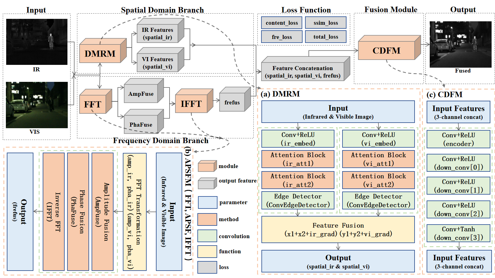

# 



## (a)DMRM ""

## (b)APSFM ""

## (c)CDFM ""


## Environments

```
python 3.10
cuda 11.8
```

## Install

```
conda create -n DPFFusion python=3.10
conda activate DPFFusion
pip install -r requirements.txt
```

## Train

The training process needs wandb API key.
The config file is `./configs/cfg.yaml`

```
python train.py
```

## Inference

```
python fuse.py
```

## Dataset

Datasets (M3FD, MSRS, RoadScene) are used to train. You can get it from [here](https://pan.baidu.com/s/1lmLmkbbSMr_PEwZdr3HPhg?pwd=ktvq).
