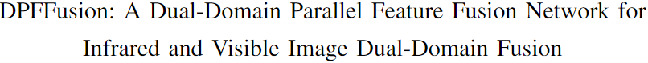
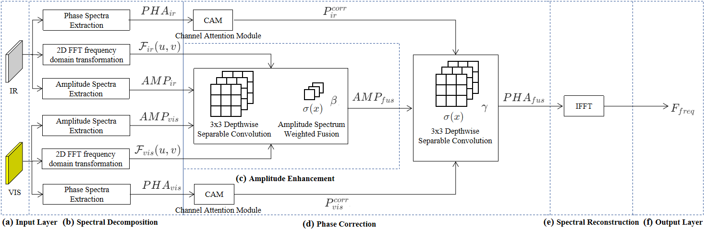

# 


(a) ""

(b) ""

(c) ""


## Environments

```
python 3.10
cuda 11.8
```

## Install

```
conda create -n DDCFusionNet python=3.10
conda activate DDCFusionNet
pip install -r requirements.txt
```

## Train

The training process needs wandb API key.
The config file is `./configs/cfg.yaml`

```
python train.py
```

## Inference

```
python fuse.py
```

## Dataset

MSRS dataset is used to train. You can get it from [here](https://pan.baidu.com/s/1IrlqjmyvwWe5OHZEiiAtTA?pwd=e6yg).
